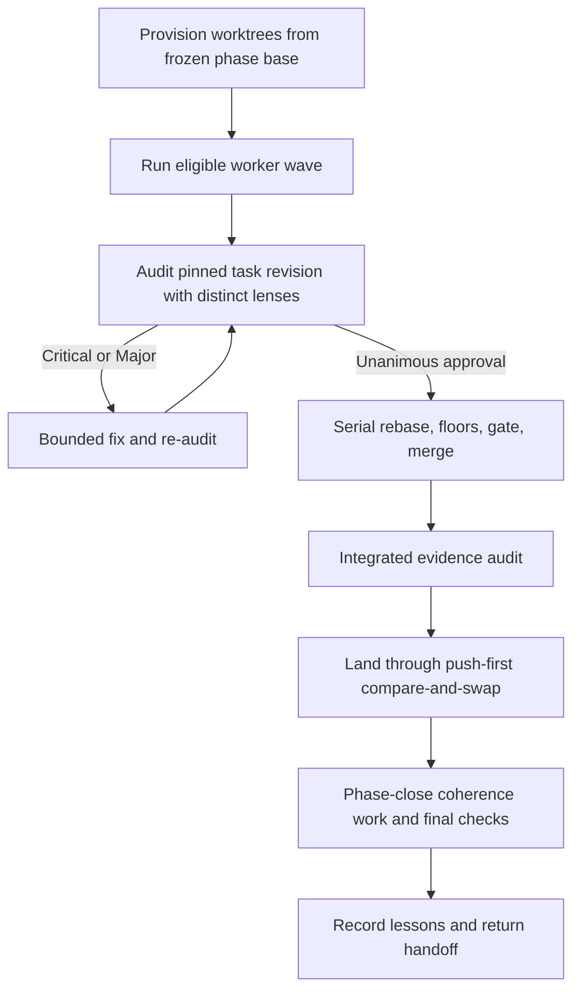

# WorkAuditRefine → Codex: source analysis and port design

Analyzed 2026-09-07. Baseline: WorkAuditRefine **0.21.12**, commit **ba08a77f812fe3e00fdf21aa5114a3f00f90df4b**. Local Codex CLI: **0.153.4**; Node: **24.17.0**.

## Recommendation

Port WAR as a **Codex plugin with a small Node execution runner**, preserving the existing orchestration engine and replacing its Claude agent-dispatch boundary. Use native Codex subagents for the first read-only audit experience; use programmatically controlled Codex sessions for the full deterministic phase engine. Start with a `codex exec` adapter to prove behavior, then use App Server if interactive approvals, interruption, or richer lifecycle control require it.

The difficult part is preserving execution contracts: independent audits on a pinned revision, validated results, serial integration, restricted roles, and recovery after partial side effects. Renaming directories and changing model names will not accomplish that.

This is a port design, not an implemented port. I assume the first target is local Codex desktop/CLI on macOS, with eventual broader local distribution. Browser-only ChatGPT and Codex cloud are separate targets because WAR requires local processes, git worktrees, and durable execution state.

## Evidence and scope

The installed plugin contains a clean Git checkout with the upstream remote `https://github.com/Ljferrer/WorkAuditRefine.git`. I read its implementation, agent cards, hooks, configuration, recovery documentation, test harness, and supporting architecture decisions. I exported its tracked files to a scratch directory before running tests. The installed plugin was not modified.

The snapshot has 12 public skills, 5 agent files, 50 ADR files, and 52 JavaScript/shell test files. There is no application package manifest or top-level build runner. The 5,166-line phase engine is 525,209 bytes; the red-team scaffold is another 376 lines. The source includes substantial historical plans, lessons, and vendored prose-lint rules; raw repository size would therefore overstate the runtime port surface.

Verification performed:

- All JavaScript tests: **1,634 passed; 0 failed, skipped, or cancelled**.
- Targeted existing scope, auditor-command, and provenance hook suites: **49/49, 111/111, and 27/27 passed**, respectively. Worktree provisioning suite: **456/456 passed**.
- Synthetic hook-input compatibility probes reproduced the patch-path and missing-role issues described below. These invoked validation scripts only; no proposed file write or shell mutation was executed.
- Generated the installed Codex App Server protocol schemas and inspected thread/turn configuration fields. CLI help confirms working-directory selection, sandbox selection, JSONL events, and final-response schemas.

The JavaScript suite uses mocked agents. Its success establishes an engine baseline, not successful live Codex dispatch, model quality, sandbox enforcement, or end-to-end git/GitHub integration. I did not run all shell suites or a live model phase. Remote HEAD could not be checked through shell DNS; the browser fetched the GitHub repository page, but that cached page does not establish current HEAD. Findings are pinned to the local commit above.

## What WAR actually is

WAR combines three systems that should remain distinct during the port.

**Planning and operator interaction.** `war-strategy` turns an interview or draft into one merged plan containing decisions and executable decomposition. `war-room` produces role and execution configuration. `red-team` tests the plan's claims before execution. The outer pipeline can mine issues and lessons into specs (`survey-corps`), convert specs into plans (`war-machine`), and queue their execution (`war-campaign`).

**Deterministic coordination with agent-executed operations.** The phase engine schedules dependency waves, routes verdicts and failures, meters retry budgets, and sequences integration. Workers, auditors, and refiners perform reasoning and tool operations. This distinction matters: the orchestration is code, but many mechanical facts still arrive through an agent's structured report. A schema-valid claim that a gate passed is not independent evidence that the gate ran on the intended commit.

**Evidence, recovery, and memory.** Git refs, recorded revisions, gate outputs, issue records, run manifests, and lesson files support continuation and review. Memory is already an explicit subsystem rather than merely Claude's conversational recall.

The phase path is:



This diagram summarizes the main sequence; the implementation also contains absorb/revert/re-audit paths, partial-phase outcomes, and repeated landing paths. Porting only the diagram would lose substantial behavior.

Sources: [phase engine](https://github.com/Ljferrer/WorkAuditRefine/blob/ba08a77f812fe3e00fdf21aa5114a3f00f90df4b/skills/war/assets/workflow-template.js), [execution design](https://github.com/Ljferrer/WorkAuditRefine/blob/ba08a77f812fe3e00fdf21aa5114a3f00f90df4b/skills/war/references/design.md).

## Preserve these contracts

1. **An explicit plan supplies scope and intent.** Preserve the decision record, task slices, dependencies, acceptance commands, and deferred validations. Do not let an adapter invent intent or waive a missing check.
2. **Isolation and visibility are separate.** Tasks start from a frozen phase base. Dependency waves control scheduling; required rebases expose integrated predecessors. File-disjoint parallel tasks remain the default decomposition rule.
3. **Approval names the code approved.** Keep `audit_sha`, independent lenses, unanimous approval, Critical/Major blocking, and the existing conditions for transferring an approval across changes. A worker's statement that it finished never substitutes for a verdict.
4. **Only one integration operation advances shared state at a time.** Preserve refinery worktree ownership, merge floors, captured gate evidence, and push-first landing checks. Distinguish a stale destination from a code conflict.
5. **Failure categories retain their meaning.** Environment failures, invalid agent results, exhausted fixes, unmet acceptance checks, and failed landings require different recovery. Preserve floor exit distinctions instead of flattening nonzero outcomes into “test failed.”
6. **Recovery follows git.** The precedence is git branch state, then issue labels, then ledger records. Repair lagging records toward git; unexplained commits halt reconciliation. Keep already completed work.
7. **Disposition is separate from severity.** Preserve absorb/follow-up/note/ask routing, deferred findings, their provenance, and human rulings. Do not quietly lose findings when a process dies.

Sources: [recovery contract](https://github.com/Ljferrer/WorkAuditRefine/blob/ba08a77f812fe3e00fdf21aa5114a3f00f90df4b/skills/war/references/resume-and-recovery.md), [land decisions](https://github.com/Ljferrer/WorkAuditRefine/blob/ba08a77f812fe3e00fdf21aa5114a3f00f90df4b/skills/war/assets/land-decision.mjs), [provisioning](https://github.com/Ljferrer/WorkAuditRefine/blob/ba08a77f812fe3e00fdf21aa5114a3f00f90df4b/skills/war/assets/provision-worktrees.sh).

## Component-by-component port map

| Component | Reuse | Required change |
|---|---|---|
| Plan format, lens doctrine, decision records | High | Update invocation and runtime references; retain semantics |
| `war-strategy`, `war-help`, `war-machine` | High | Codex instructions, paths, configuration, and invocation policy |
| `war-room` and `war-config.mjs` | Partial | Replace Claude-specific model validation and presets; validate supported model/effort pairs |
| `snipe` | High | Native read-only Codex agents or runner-backed audit dispatch; validate outputs |
| `workflow-template.js` | High control-flow reuse | Supply agent dispatch and runtime functions; durable event/result recording |
| `red-team/assets/workflow-scaffold.js` | High control-flow reuse | Same adapter, with distinct permissions for analysis and executed probes |
| Shell floors and git provisioning | High | Explicit state locations; sandbox/git-common-directory compatibility; retained exit semantics |
| `agents/*.md` | Partial | Convert role instructions; replace Claude tool allowlists and plugin-root links |
| `hooks/hooks.json` and guards | Partial | Payload normalization, role identity, patch parsing, lifecycle events, trust validation |
| `war-memory.mjs` | High | Explicit local root; replace Claude-specific memory discovery and projection assumptions |
| `war-campaign`, `aftermath` | Partial | Durable controller state and recovery; defer cleanup until ownership proofs work |
| `war-review` | Partial | Consume adapter-owned events and Codex usage data instead of Claude transcript layouts |
| Package/release system | Partial | Codex manifest; explicit exported skills; update version-slot and release-file guards |

The plugin's fifth agent file is `war-setup-scout.md`; only four agent files are listed in the Claude manifest. Check its actual dispatch path before deciding whether the Codex package must register it. Do not mechanically export every Markdown file as an executable role.

## The smallest useful execution boundary

The strongest finding is in the current test harness. It removes the `export` marker from metadata and executes the engine using an async function with injected `agent`, `parallel`, `pipeline`, `log`, `phase`, `args`, and `budget` parameters. The engine already centralizes actual model dispatch through `dispatch(prompt, opts)` and a leaf semaphore.

That establishes a practical compatibility strategy: host the existing engine in Node and supply those runtime dependencies. First reproduce the tested behavior; only then consider extracting modules. The injected-function mechanism is suitable for trusted, pinned engine code, not arbitrary plan text or untrusted downloaded JavaScript.

Use a small internal request object, conceptually:

```text
dispatch identity: run / phase / task / role / attempt
execution scope: repository, worktree, expected base and current revision
role setup: instructions, tools/capabilities, model and effort
input/output: prompt, expected result schema, validated result
lifecycle: started, completed, failed, interrupted, permission-needed
evidence: Codex session id, events, usage, relevant git/gate artifacts
```

Do not extract the worktree path from prose. The existing call metadata has role, labels, schemas, and model options; the adapter needs explicit execution context added where necessary. Audit-result validation must check semantic correspondence—task, seat, lens, and revision—not just JSON shape. Schema normalization also needs care: WAR uses optional properties and conditional schemas; do not assume Codex's schema handling matches Claude's exactly.

Source: [existing Node behavioral harness](https://github.com/Ljferrer/WorkAuditRefine/blob/ba08a77f812fe3e00fdf21aa5114a3f00f90df4b/skills/war/assets/workflow-template.test.mjs).

## Choose the runtime deliberately

| Option | Strength | Cost | Recommendation |
|---|---|---|---|
| Skills plus native subagents | Best native interactive experience; minimal startup work | Lead must coordinate lifecycle and validate results; no demonstrated drop-in durable Workflow runtime | Use for `snipe` and early interactive workflows |
| Node plus `codex exec` | Small adapter; separate cwd/sandbox per invocation; JSONL and schema output | Subprocess cancellation, permissions, output validation, and recovery are ours | First full-phase feasibility slice |
| Node plus Codex App Server | Explicit thread/turn lifecycle and configuration | Protocol/client complexity and compatibility testing | Production direction if lifecycle requirements justify it |
| Full orchestration rewrite | Can remove accumulated runtime constraints | Highest regression risk and largest review surface | Avoid as the initial migration |

The installed App Server schemas expose `cwd`, model, configuration and developer instructions at thread creation, plus effort, sandbox policy and output schema at turn start. Official documentation describes turn-specific output schemas and configuration overrides. This is a credible adapter surface; it is not yet a tested adapter. [App Server documentation](https://learn.chatgpt.com/docs/app-server).

Codex's current documentation also supports custom agent TOML configuration, including read-only sandboxes and role instructions. Native delegation is available when requested by users or applicable instructions. [Subagent documentation](https://learn.chatgpt.com/docs/agent-configuration/subagents).

Do not confuse programmatic Codex sessions with user-owned sidebar tasks. This session's desktop task-creation tools are intended for explicitly requested new tasks; using those for every WAR worker would be the wrong integration. Internal runner sessions or native subagents are the appropriate execution units. Nor should the runner assume its sessions automatically appear as native child-agent cards in the app; that UI integration remains to be verified.

## Compatibility hazards that need explicit tests

### 1. Hook discovery does not establish enforcement

The current scope guard reads `tool_input.file_path`, `path`, or `notebook_path`, and allows a missing path. A synthetic worker `Write` outside any marked worktree was denied with exit 2. An equivalent synthetic `apply_patch` request was allowed with exit 0. The auditor Bash guard denied a mutation with WAR's role set, but allowed the same payload without `agent_type`.

These are verified payload-compatibility failures, not a claim that a live Codex auditor escaped confinement. The old tests pass because they exercise their existing input contract.

Codex documents `apply_patch` input in `tool_input.command`, aliases for Write/Edit matching, and `agent_type` on subagent lifecycle events. Its PreToolUse reference does not establish that role field there. Hooks require trust, and some tool paths are exceptions. Treat sandbox policy as the primary boundary; validate hooks as supplementary checks. [Codex hooks](https://learn.chatgpt.com/docs/hooks).

The port must inspect every affected path, including patch additions, updates, deletions and renames; resolve paths against the actual cwd; and handle symlinks. Servitor provenance checks need reconstructed resulting content, not a search for metadata anywhere in patch text. Give runner sessions explicit role identity rather than depending on an undocumented field. Existing role guards have acknowledged residuals; the migration should neither exaggerate nor silently weaken their guarantees.

Sources: [scope guard](https://github.com/Ljferrer/WorkAuditRefine/blob/ba08a77f812fe3e00fdf21aa5114a3f00f90df4b/hooks/validate-worktree-scope.sh), [auditor guard](https://github.com/Ljferrer/WorkAuditRefine/blob/ba08a77f812fe3e00fdf21aa5114a3f00f90df4b/hooks/validate-auditor-git.sh), [provenance guard](https://github.com/Ljferrer/WorkAuditRefine/blob/ba08a77f812fe3e00fdf21aa5114a3f00f90df4b/hooks/validate-servitor-provenance.sh).

### 2. Worktrees share git metadata

An isolated directory is not an isolated repository. Linked worktrees share refs and the common git directory. A worker sandbox must support legitimate commits without opening every sibling checkout to writes. Auditors should receive read-only access to the intended repository snapshot and no mutating connectors. Reproducing commands that generate output belongs in an isolated validation environment, not by casually widening auditor permissions.

Test a worker commit, sibling-file denial, refinery merge, and nested submodule separately. Do not “fix” a git sandbox error by enabling full access. Preserve explicit ownership and task markers even when the sandbox adds stronger confinement.

### 3. A journal is not an exactly-once transaction

Claude's Workflow journal and `resumeFromRunId` behavior are woven into recovery instructions. A Node wrapper does not inherit them. A Codex session resume is likewise not proof that a git operation or issue creation should be replayed.

Record dispatch starts and validated completions with stable identities. After interruption, reconcile branch ancestry and external artifacts before deciding whether to retry. A crash after push but before recording success is a required test. Issue creation needs a durable correlation key and duplicate reconciliation. Persist carried findings and rulings at mutation boundaries, not only at the final phase return.

Start with explicit reconciliation and fresh recovery dispatch; do not promise transparent replay. Preserve the current halt behavior for unclassified workflow errors until recovery equivalence has been demonstrated.

### 4. Claude model names are validated in code

`war-config.mjs` accepts `opus`, `sonnet`, `haiku`, and `fable`, ranks them, and defines role presets. The engine mirrors some configuration because the Claude Workflow environment cannot import modules. This affects `war-room`, `snipe`, dispatched prompts, and tests.

Preserve the role/tier concept, but use Codex-supported configuration with explicit capability checks. There is no defensible name-only equivalence between the two model families. Initially use the user's configured Codex model or an explicitly chosen supported profile; tune cost/quality presets using actual audit and implementation outcomes. Never silently downgrade a role when a model or effort is unavailable.

Source: [configuration implementation](https://github.com/Ljferrer/WorkAuditRefine/blob/ba08a77f812fe3e00fdf21aa5114a3f00f90df4b/skills/war/assets/war-config.mjs).

### 5. Paths are storage contracts

`.claude/war`, `.claude/teams`, `.claude/campaigns`, and `.claude/aot` appear across runbooks, hooks, worktree cleanup, and configuration. Personal memory discovery additionally assumes Claude's project-slug layout.

For the compatibility slice, retain existing repository state paths and pass them explicitly. Branding is less important than keeping old recovery evidence discoverable. Later introduce an explicit storage root with a schema version and legacy reader. Retain `docs/learnings` as the shared lesson store and define an explicit personal root for Codex; do not assume Codex automatically consumes WAR's generated `MEMORY.md`. Existing prompt-prefetch retrieval can work independently of automatic memory loading.

Source: [memory CLI](https://github.com/Ljferrer/WorkAuditRefine/blob/ba08a77f812fe3e00fdf21aa5114a3f00f90df4b/skills/_shared/war-memory.mjs).

### 6. Packaging and telemetry are not mechanical copies

Codex supports a `.codex-plugin/plugin.json` package with skills and optional MCP integration. Test local packaging before publishing. [Plugin authoring](https://learn.chatgpt.com/docs/build-plugins).

Preserve the existing explicit public skill list; `_shared` is not an invocable skill. Translate manual-only invocation behavior rather than assuming Claude frontmatter enforces it. Update all release-version slots and the engine's release-file exclusion set when adding a Codex manifest. Replace plugin-root placeholders through a known resolver; do not merely invent a replacement environment variable.

`war-review` expects Claude `journal.jsonl` and `agent-*.jsonl` artifacts, with manifest totals preferred where available. Emit a runner-owned event format, retain raw Codex events for diagnosis, and use null/unavailable for missing metrics. Preserve units and cache semantics rather than equating unlike counters. Campaign re-entry should use durable state and the actual Codex compaction lifecycle; changing an old hook's name alone is insufficient.

Source: [review workflow](https://github.com/Ljferrer/WorkAuditRefine/blob/ba08a77f812fe3e00fdf21aa5114a3f00f90df4b/skills/war-review/SKILL.md).

## Implementation sequence and acceptance gates

**Slice 1 — package and read-only audit.** Create a Codex package in a development checkout, adapt `war-help` and `snipe`, and establish a read-only role. Audit one fixed diff with two independent lenses. Gate: correct revision/lens attribution, validated results, zero file mutations, malformed output fails visibly, model configuration is honored. This delivers a useful feature while proving role isolation.

**Slice 2 — execute the existing engine locally.** Implement the injected-runtime runner and one `codex exec` backend. Exercise one small task in a disposable repository with a local bare remote. Preserve the existing engine and use its harness as a comparison oracle. Gate: worker commit, pinned audit, bounded correction, serial merge, captured validation and successful phase landing; malformed results and process death hold the phase. External GitHub effects can be stubbed in this explicitly labeled test, not silently omitted in a claimed production run.

**Slice 3 — prove concurrency and recovery.** Add two independent workers, one dependency, multiple audit lenses, and competing remote advancement. Kill execution after commit, after merge, and after push. Gate: completed work survives, approvals apply to the intended revision, no duplicate integration, unexplained commits halt, semaphore drains after failures, every deferred finding survives restart.

**Slice 4 — complete permissions and operator interaction.** Validate patch normalization and role policy end to end; add a real permission-needed state and cancellation handling. Adopt App Server here if the subprocess transport cannot provide the required interaction. Gate: denied actions are surfaced without bypass; interruption stops descendants and preserves evidence; a user ruling resumes the intended attempt.

**Slice 5 — restore the surrounding workflows.** Port red-team execution/confirmation, GitHub issue reconciliation, memory recording and promotion, and run review. Gate: a reproduced blocker prevents execution; a missing environment is classified distinctly; follow-ups are idempotent; provenance and redaction controls hold; missing usage is reported honestly.

**Slice 6 — unattended operation and cleanup.** Add campaign continuation, compaction/restart re-entry, submodules, and aftermath only after recovery and ownership tests pass. Gate: restart at every phase boundary; no deletion of another run's work; no advancement past a hard failure; cleanup requires verifiable landing evidence.

Each slice should be independently reviewable. Preserve Claude compatibility in the same repository unless a concrete packaging constraint forces a split. A second complete copy of the engine would multiply the drift problem immediately.

## Improvements to defer until parity exists

Node removes the no-import constraint, so mirrored constants and runtime helpers can eventually become shared imports. Some deterministic git probes and gates can also move from refiner prompts into direct runner operations, reducing model calls and improving evidence quality. Both are worthwhile, but each changes the implementation boundary; introduce them after the adapter reproduces existing outcomes.

The current stage helper strips comments to accommodate a measured 524,288-byte Claude script cap. Its special handling need not exist in a Node-only execution path, although a dual-runtime package still needs the Claude staging path. Do not make eliminating all old constraints a prerequisite for the first useful Codex release.

The repository's CI workflow currently runs memory redaction lint, not the complete engine suite. The port should add behavioral adapter and integration checks to CI. Existing drift/prose tests are valuable for the Claude product but are not substitutes for live permission, cancellation, and recovery tests on Codex.

## Decisions worth making next

My defaults are: one shared repository; local desktop/CLI first; preserve the engine; retain existing state locations during the compatibility slice; use configured Codex models initially; deliver `snipe`, then one full phase; postpone campaign automation and cleanup.

The largest product decision is whether **every worker must appear as a native child agent in the desktop UI**. If yes, validate that host integration before committing to the standalone runner. If reliable deterministic execution is the priority, the runner gives the clearest path and can expose concise progress to the parent task. Neither option requires rewriting WAR's planning and audit doctrine.


## Repository strategy addendum — 2026-09-07

Status: recommendation for discussion, not a ratified decision or authorization to implement.

**Use WorkAuditRefine as the canonical source repository for both runtimes.** Keep WarOnCodex as the requested planning archive or a temporary experiment, rather than maintaining a second evolving copy of WAR. One source repository can publish two runtime-specific plugin packages or entry points. Source synchronization and release synchronization are different concerns: shared fixes should land together, while an experimental Codex release need not alter the stable Claude release channel.

### Why this is the better fit

The user's stated priority is to keep Claude and Codex as closely synchronized as possible without breaking either. Separate maintained repositories would require propagation of every engine fix, audit rule, schema change, and regression test. WAR already has mirrored-surface drift checks; another full copy would add a larger synchronization obligation. A single change and review covering shared behavior and both adapters gives the strongest practical control.

Repository separation is not runtime isolation. Separate adapters, package discovery, permission policy, and compatibility tests provide that isolation even when the code is in one repository. Conversely, a fork can diverge while looking safer because it cannot immediately affect Claude.

### Minimal initial layout

Retain the existing Claude manifest, skills, engine, agents, and hooks in their current locations. Add a Codex manifest plus a runtime-specific subtree for the Codex runner, skill entry points, and hooks. Both consume the existing engine and shared helpers. The exact folder names are implementation choices, not required scaffolding.

Keep the Codex skill entry points thin: load shared doctrine and invoke the Codex adapter. Do not duplicate full skill bodies, and do not fill the common engine with scattered runtime-name conditionals. Initially preserve the existing engine as the common source; modular extraction comes only when it reduces demonstrated duplication without changing behavior.

The package must be self-contained when installed from a cache. Runtime files must resolve shared assets inside the installed plugin root, not reach into a sibling checkout. If one root package cannot cleanly isolate discovery, generate two self-contained release artifacts from the same source revision. Generated copies are acceptable; independently edited copies are not.

### Verified packaging support and limits

Codex's packaging documentation describes `.codex-plugin/plugin.json` and explicit paths for skills and hooks. An explicit `hooks` entry replaces the default `hooks/hooks.json` discovery. Thus the Codex manifest can select its adapter hooks while the existing Claude package retains its own hooks. Codex also supplies Claude-compatible plugin-root variables to hook commands; that does not establish substitution behavior for arbitrary skill or agent prose. [Codex packaging reference](https://developers.openai.com/plugins/build/plugins).

Claude documents its own manifest, component locations, and plugin caching rules. These support keeping its package intact. They do not by themselves prove a particular dual-manifest layout works: installation, discovery, and hook execution must be tested on both actual clients before release. [Claude plugin reference](https://code.claude.com/docs/en/plugins-reference).

### Controls that prevent breakage and drift

1. **Preserve the stable Claude entry point first.** Add Codex support without moving the existing installation paths or changing Claude's default execution. No Codex binary or credentials may become a requirement for Claude-only operation.
2. **Keep common behavior authoritative in one place.** Share the engine, result contracts, audit doctrine, and platform-independent helpers. Keep dispatch, role/tool configuration, lifecycle normalization, model configuration, and telemetry parsing in their runtime adapters.
3. **Require a compatibility matrix for shared changes.** Run common behavioral tests, Claude contract/package tests, and Codex contract/package tests against the same source revision. Include installation from packaged artifacts, correct hook selection, permission denial, and recovery cases. Mock tests establish contracts; live smoke tests validate the actual harness boundary.
4. **Separate release maturity from source ownership.** Keep Codex opt-in and experimental until its acceptance gates pass. Record the common source SHA in both artifacts. Do not silently repoint stable Claude installs at an unvalidated development revision. Version-slot automation must match the chosen release scheme.
5. **Separate active runtime state.** Shared schemas and an explicit common lesson store are useful; concurrent mutation of one live ledger by both runtimes is not. Stamp runtime, engine version, and schema version into new records and enforce a single active owner per run. Cross-runtime takeover needs an explicit reconciliation procedure, not accidental reuse.
6. **Test the boundaries that actually differ.** Patch payloads, hook identity, read-only audits, worktree git metadata, interrupted dispatch, schema validation, and provider model settings deserve adapter-specific tests. Do not infer parity from shared prompts or passing JavaScript mocks.

### Role of WarOnCodex

This commit preserves the analysis here as requested. It does not create or endorse a permanent fork. If the recommendation is accepted, implementation should happen on a development branch/worktree of WorkAuditRefine, with small changes introducing the Codex adapter. WarOnCodex can remain a historical pointer or be archived later by explicit choice. If experimentation happens here first, keep it bounded and upstream the adapter before it becomes a second product implementation.

A separate maintained repository becomes justified only if ownership, access controls, or independently governed product scope requires it. Even then, depend on a pinned shared core or generated artifacts; avoid copying and manually synchronizing the engine.

### Source-checkout note

The earlier analysis remains pinned to installed version 0.21.12 at ba08a77f812fe3e00fdf21aa5114a3f00f90df4b. The subsequently located WorkAuditRefine working checkout was at cf9f93e07afc6c07792c3f9f9842e973a4a154b4 and its manifest said 0.20.1. This is a different local checkout state, not proof of the current upstream release. Reconcile the intended development base before implementing the port; do not overwrite or reset that checkout based on the installed cache.
